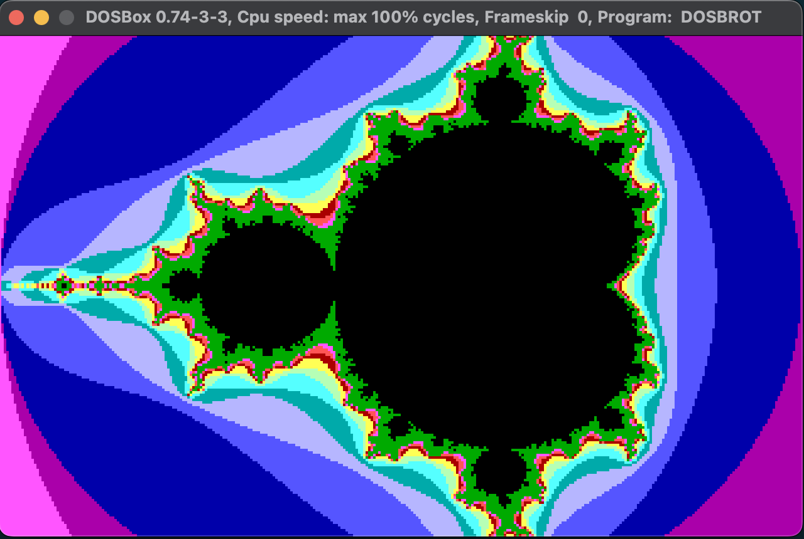

# Dosbrot - Mandelbrot Set Renderer for PC DOS
**Dosbrot** is a lightweight Mandelbrot Set renderer for PC DOS systems.
You can download the EXE file from [itch.io](https://ms0g.itch.io/dosbrot).



## Prerequisites
- **Turbo C++** (`TCC.EXE`) version 3.0 or later  
- **Turbo Assembler** (`TASM.EXE`) version 4.1 or later  
- **Turbo Linker** (`TLINK.EXE`) version 5.0 or later  
- **DOSBox** emulator or a real MS-DOS-compatible computer

## Building
```bash
C:\>MAKE.EXE
```
or
```
C:\>TASM /ml VGA.ASM
C:\>TCC.EXE DOSBROT.C VGA.OBJ
```

## Run
```bash
C:\>DOSBROT.EXE
```

## License

This project is licensed under the MIT License. See the LICENSE file for details.
